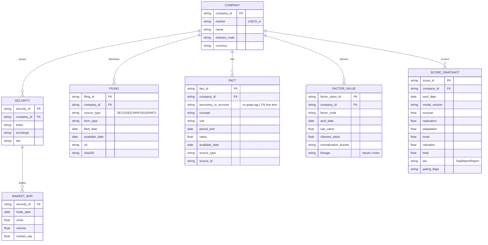
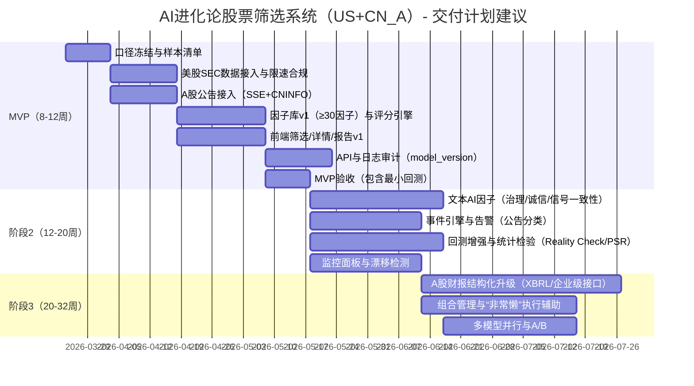

# AI进化论股票筛选系统PRD（美股+中国A股）

## 执行摘要

本PRD定义一个“AI + 进化论投资方法论”的**可量化股票筛选系统**，同时覆盖美股与中国A股两大市场：以《我从达尔文那里学到的投资知识》的“三条箴言/三步流程”为方法论内核——**先避大风险（Avoid big risks）→ 再买高质量且价格公允（Buy high quality at a fair price）→ 最后“不要懒，要非常懒”（Don’t be lazy—be very lazy）**，把书中的“进化与选择”逻辑落地为一套**可解释、可审计、可回测、可迭代**的五大评分维度：生存力、复制力、适应力、优势积累、估值纪律。citeturn0search0turn0search4

系统目标不是预测短期涨跌，而是通过“先排除高概率永久性损失标的（减少Type I错误）”与“识别少数可长期复利的高质量企业”，把书中强调的“排除绝大多数机会、长期持有少数高质量企业”的投资流程，工程化为：**数据管道（官方披露优先）+ 因子库（可量化）+ 评分引擎（可解释）+ 筛选产品（面向投研/量化/专业投资者）+ 回测验证与监控迭代**。citeturn0search0turn9view0

本PRD将提供并满足以下交付要求：  
- 系统化摘录书中核心观点（基于可公开访问的出版社概要、章节目录与公开书评梳理），并逐条映射为可量化维度与二级因子；citeturn0search0turn6view0turn9view0  
- 五大维度每维至少6个二级因子（共≥30因子），每个因子明确：定义、经济直觉、**美股与A股**各自优先官方/原始数据源、抓取实现建议、频率与清洗规则、字段样例、评分规则（区间/离散或连续/归一化/缺失/行业市值地域调整）；citeturn3view4turn4view2turn0search2turn0search10turn3view1  
- 输出完整PRD：功能分期（MVP/阶段2/阶段3）、数据架构ER图（mermaid）、甘特图（mermaid）、至少5张表格（因子表、字段映射表、抓取计划表、评分规则表、权重方案表）、API示例、回测与统计检验方案、监控与迭代流程、未指定假设清单。citeturn3view4turn4view4turn4view2turn4view3

> 重要范围说明（与“系统化阅读并摘录原文”要求相关）：本PRD对书中内容的“摘录/观点归纳”严格依赖**公开可获取材料**（出版社简介、可访问的目录、公开书评的要点梳理）。由于无法在此环境中合法读取全书正文，凡涉及书内更细观点，将明确标注“来源类型：公开书评/二手梳理”，并在产品落地阶段建议团队购买电子版/纸书用于一轮“原文校对与因子定义固化”。citeturn0search0turn6view0turn9view0

## 方法论摘录与评分维度映射

### 书中可验证的核心主张摘要

从出版方对本书的正式简介可直接确认以下“方法论骨架”：

- 三条箴言/流程：Avoid big risks；Buy high quality at a fair price；Don’t be lazy—be very lazy。citeturn0search0  
- 方法论导向：该流程会**排除绝大多数投资机会**，并主张**长期（甚至“永久”）持有高质量企业**。citeturn0search0  

公开书评对书中细观点的二手梳理（需在落地期用原文进一步核对）补充了若干关键“可量化启发”：

- 在不对称的投资机会分布下，更应优先降低“错误买入坏标的”的Type I错误，而容忍“错过好标的”的Type II错误；citeturn9view0  
- 强调“成本高、难伪造”的信号（如长期经营与财务历史、来自产业链的调研信号）比便宜信号更可信；citeturn9view0  
- 强调“历史与模式”（convergence patterns、stasis）而非精确预测未来；citeturn9view0  
- 倾向“强资产负债表、低债务”的稳健性；citeturn9view0  
- 风险优先、质量其次、估值最后，并对传统DCF在关键输入（折现率、远期现金流）上的不确定性保持谨慎。citeturn9view0  

为构建“优势积累（护城河）”维度的经济学底座，本PRD引用entity["organization","Berkshire Hathaway","holding company | omaha, ne, us"] 1991年股东信对“economic franchise”的经典定义：需要/想要、无近似替代、非价格管制（并由此带来强定价权与高资本回报）。这为“定价权/替代性/监管约束”因子提供可复核的理论锚点。citeturn0search26

### 表一：观点到维度的映射（含“来源类型”标记）

| 书中观点（摘要） | 量化设计含义 | 映射一级维度 | 关键机制（产品/模型） | 来源类型 |
|---|---|---|---|---|
| “Avoid big risks” | 先排除导致“永久性损失”的高风险公司；引入红线（硬门槛） | 生存力 | 红线gating、风险事件惩罚、杠杆与现金流韧性因子 | 出版社简介 |
| “Buy high quality at a fair price” | 质量要可量化：长期资本回报、增量回报、现金流质量、资本配置 | 复制力 + 优势积累 | ROIC/ROCE、增量ROIC、复利可持续性（ROIC×再投资率） | 出版社简介 + 公开书评 |
| “Don’t be lazy—be very lazy” | 少交易、长期持有；系统输出“Top/Watch/Reject”分层，而非短期买卖信号 | 优势积累 + 估值纪律 | 分层与再平衡节奏（季/月）、事件告警与“基本面是否破坏”判断 | 出版社简介 |
| Type I/Type II错误框架 | 机会分布偏斜时应更重视减少Type I错误（错买坏公司） | 生存力优先的权重设计 | 权重方案中“保守版提高生存力权重”；回测指标加入“爆雷/退市率” | 公开书评（二手） |
| “成本高的信号更可信” | 优先使用官方披露、长期财务事实、可核验事件；AI做“抽取+交叉验证” | 全维度（尤其适应力/优势积累） | SEC XBRL事实、交易所公告、年报风险因素/MD&A语义特征 | 公开书评（二手） |

> 注：出版社明确给出三条箴言与“排除多数机会、长期持有高质量公司”的主张，是本PRD最强“可验证原始来源”。citeturn0search0  
> 对Type I/II、costly signals、convergence patterns等更细观点，本PRD已标注为“公开书评（二手）”，建议在落地阶段以购书原文复核并固化因子定义与阈值。citeturn9view0turn6view0

## 评分体系、权重方案与分层规则

### 统一评分规范（跨美股与A股）

- 单因子得分：`0–100`（越高越好）。  
- 单维度得分：该维度内有效因子加权平均（缺失因子触发“权重重分配”或惩罚）。  
- 总分：五大维度加权平均，并叠加红线gating（先避险）。  
- 归一化：默认采用“同市场×同一级行业×市值分组”的**分位数归一化**（P5–P95线性缩放，截尾防极值）。  
- 行业/市值/地域调整：  
  - 行业：美股优先用SEC SIC/GICS（如有）或供应商行业；A股优先用证监会行业或Wind/申万；同业可比性由“行业模板”解决；citeturn4view4turn1search6  
  - 市值：按对数市值分桶（如5桶），避免小市值“高波动高极值”误导；  
  - 地域：美股与A股**分别评分、分别分层**；若需要“跨市场合并Top榜”，再做二次标准化（以市场为维度加入校准项）。  

### 缺失值处理（三类）

1) 不适用（NA）：如银行/券商对ROIC口径不适配 → 该因子对该票NA，维度内剩余因子**等比例重分配权重**。  
2) 应披露但缺失：抓取失败或披露异常 → 惩罚性得分（默认40）并打“披露缺失”标签。  
3) 历史不足：新股/数据不足 → 中性得分（50）+ 该维度上限封顶（如≤80），并在分层中限制进入Top（例如上市<180天不得入Top）。  

### 表二：维度权重方案（基准/保守/激进）

| 方案 | 生存力 | 复制力 | 适应力 | 优势积累 | 估值纪律 | 适用风格 |
|---|---:|---:|---:|---:|---:|---|
| 基准（Balanced） | 25% | 20% | 15% | 25% | 15% | 长期质量为主、兼顾估值 |
| 保守（Conservative） | 30% | 18% | 12% | 25% | 15% | 强调先避险（减少Type I错误） |
| 激进（Aggressive） | 20% | 25% | 20% | 25% | 10% | 更偏向成长与适应性，降低估值约束 |

权重的“顺序逻辑”与书中三步流程一致：先避大风险，再质量，估值最后；并与公开书评对书中“风险优先、质量其次、估值最后”的归纳一致。citeturn0search0turn9view0

### 总评分公式、红线与分层

**维度得分**：  
\[
Score_D = \sum_{f\in F_D} w_{D,f}\cdot score_{D,f}
\]
其中 \( \sum w_{D,f}=1 \)（仅对有效因子归一）。

**总分**：  
\[
TotalScore=\sum_D W_D\cdot Score_D
\]

**红线（gating）示例（可配置）**：贯彻“先避大风险”。citeturn0search0turn9view0  
- 杠杆与偿债：`利息保障倍数 < 1.5` 或 `NetDebt/EBITDA > 4` → 最多Watch或直Reject（按严重度）；  
- 重大诚信/披露红旗：严重更正、重大监管处罚、重大舞弊信号 → 直Reject；  
- 极端估值：估值分位 > 99 且（复制力+优势积累）< 80 → 最多Watch（防“泡沫买贵”）。

**分层阈值（初版建议）**：  
- Top：`TotalScore ≥ 75` 且无红线；  
- Watch：`55 ≤ TotalScore < 75` 或触发“轻度红线”；  
- Reject：`TotalScore < 55` 或触发“强红线”。

## 因子库与评分模型（五维×30因子，含美股/ A股双市场数据源与实现）

### 数据源模块总览（用于在30因子表中复用）

本系统优先使用官方/原始披露：美股以entity["organization","U.S. Securities and Exchange Commission","federal regulator | washington, dc, us"] 的EDGAR数据API为核心，提供公司提交历史、XBRL事实、日更索引，并明确实时更新与夜间批量ZIP机制。citeturn3view4turn4view4  
A股以交易所公告检索与“法定信息披露网站”为核心补齐：entity["organization","Shanghai Stock Exchange","stock exchange | shanghai, cn"] 提供公司公告检索与PDF下载入口；entity["organization","Shenzhen Stock Exchange","stock exchange | shenzhen, cn"] 提供信息披露入口；同时entity["company","深圳证券信息有限公司","market data & disclosure | shenzhen, cn"] 公开说明其旗下巨潮资讯网（CNINFO）为证监会指定深市信息披露网站、具法定披露资格。citeturn3view1turn1search0turn0search10turn0search2  
另外，entity["company","上证所信息网络有限公司","exchange info services | shanghai, cn"] 提供“沪市上市公司公告服务”，并明确公告数据可包含WORD/PDF/XBRL/TXT等格式，是A股“结构化财报/XBRL”的重要企业级路径。citeturn4view2

### 表三：数据源模块表（抓取实现建议、频率、合规要点）

| 模块ID | 市场 | 优先官方/原始数据源 | 抓取方式建议 | 更新频率 | 合规/限制要点（摘要） | 来源类型 |
|---|---|---|---|---|---|---|
| US-FIN-XBRL | 美股 | SEC data.sec.gov XBRL APIs（companyfacts / companyconcept / frames） | REST JSON；按CIK拉取；支持夜间Bulk ZIP | 实时更新+夜间批量 | 无需API Key；需遵守公平访问与User-Agent要求 | SEC-EDGAR（英文） |
| US-FILE-SUB | 美股 | SEC submissions（公司提交历史CIK.json） | REST JSON；按CIK拉取 | 实时更新 | 包含公司元数据（交易所、ticker等）与近1k条提交 | SEC-EDGAR（英文） |
| US-FILE-IDX | 美股 | EDGAR daily/full/quarter index（含index.json/xml） | 下载索引→批量队列→按需抓取正文 | 日更/夜更 | 明确索引目录结构与自动化辅助文件 | SEC-EDGAR（英文） |
| US-RATE | 美股 | SEC公平访问与限速政策 | 抓取器内置限速与缓存 | 常量 | 当前最大10 req/s；要求声明User-Agent；禁止botnet | SEC官网政策（英文） |
| CN-ANN-CNINFO | A股 | 巨潮资讯网（公告检索/公告PDF） | 网站抓取（需遵守站点规则）；企业级建议用供应商/专线 | 事件驱动 | 法定披露渠道属性由SZSI说明 | 法定披露网站（中文） |
| CN-ANN-SSE | A股 | SSE“公司公告”检索与PDF下载 | 网页抓取/下载；或与SSEinfo服务对接 | 事件驱动 | 官方页面可直接下载PDF | 交易所公告（中文） |
| CN-ANN-SZSE | A股 | SZSE信息披露入口（公告/规则） | 网页抓取+跳转公告页 | 事件驱动 | 入口级信息披露导航 | 交易所公告（中文） |
| CN-FIN-SSEINFO | A股 | SSEinfo“上市公司公告服务”（含XBRL） | 企业级采购/对接接口文档 | 事件驱动/定期 | 支持XBRL实例文档（结构化财务） | 交易所信息服务（中文） |
| CN-ACC-CAS | A股 | 财政部：企业会计准则与IFRS趋同路线图 | 用于口径差异说明与映射规则 | 低频 | 中国会计准则与IFRS趋同的官方表述 | 财政部（中文） |
| 3P-WIND | 两市场 | entity["company","万得信息技术股份有限公司","financial data vendor | shanghai, cn"] 数据接口/Client API | SDK/API（企业许可） | 多频（实时/日/季） | 企业级数据服务；用于统一口径与补齐字段 | 第三方API（中文） |
| 3P-THS | 两市场 | entity["company","同花顺","financial data & software | hangzhou, cn"] 数据接口/量化API | SDK/终端接口（许可） | 多频 | 提供基础/高频/公告等；适合快速MVP | 第三方API（中文） |

> 模块证据：SEC APIs提供companyfacts/companyconcept/frames与实时更新、夜间bulk ZIP说明；同时SEC公平访问明确10 req/s、User-Agent要求与反爬限制。citeturn3view4turn4view4turn0search5  
> A股侧：SSE公司公告页面明确可下载公告PDF；SSEinfo公告服务明确包含XBRL；SZSI说明CNINFO为证监会指定披露网站。citeturn3view1turn4view2turn0search2turn0search10  
> 会计口径：财政部文件明确我国企业会计准则与IFRS实现趋同并持续推进。citeturn4view3turn2search0

### 表四：五大维度×二级因子总表（30因子；含双市场数据源、字段、评分、权重）

> 表格列说明：  
> - “数据源（美股）/（A股）”只写“优先官方/原始来源”；若不具备可行API，则在“抓取建议”中给出“爬虫/第三方API”备选。  
> - “字段示例”为规范化后的**Canonical Schema**字段（实际抓取后需做映射）。  
> - “行业/市值/地域调整”默认：同市场内“行业×市值桶”分组分位数；跨市场榜单需二次校准。

#### 生存力（Survival）—至少6因子

| 代码 | 因子 | 定义与经济直觉 | 数据源（美股）优先官方/原始 | 数据源（A股）优先官方/原始 | 抓取建议（实现） | 频率&清洗规则 | 字段示例（Canonical） | 评分规则（0-100）与缺失处理 | 权重（基准/保守/激进） |
|---|---|---|---|---|---|---|---|---|---:|
| S1 | 杠杆与偿债压力 | 高杠杆放大坏情境并触发“被动融资/破产”，与“先避大风险”一致 | US-FIN-XBRL（负债、利息费用、现金等） | CN-FIN-SSEINFO（XBRL）或 CN-ANN-CNINFO 财报PDF表格 | 美股：companyfacts；A股：优先XBRL/供应商，抓PDF需表格抽取 | 季/年；TTM；极值P1/P99截尾 | `net_debt, ebitda_ttm, interest_expense_ttm, interest_coverage` | 连续：分位数归一+红线：`interest_coverage<1.5`或`net_debt/ebitda>4`→最多Watch；披露缺失=40 | 0.18/0.20/0.15 |
| S2 | 流动性缓冲 | 現金与短债匹配决定危机“续命”能力 | US-FIN-XBRL（现金、流动负债） | CN-FIN-SSEINFO 或 财报PDF | 同上 | 季/年；金融业走专用模板（NA重分配） | `cash, current_assets, current_liab, current_ratio, cash_ratio` | 连续：同业分位数；历史不足→50并限制Top | 0.12/0.13/0.10 |
| S3 | 自由现金流韧性 | 盈利若不能转化为现金更脆弱；FCF是“适者生存燃料” | US-FIN-XBRL（OCF、Capex） | CN-FIN-SSEINFO 或 财报PDF | 计算派生；Capex口径统一（见字段映射表） | 年/季；TTM；避免季节性用滚动4季 | `ocf_ttm, capex_ttm, fcf_ttm, fcf_margin_ttm` | 连续：FCF Margin分位数 - 波动惩罚；缺失=50 | 0.12/0.13/0.10 |
| S4 | 盈利质量（现金/利润一致性） | 高应计/低现金利润更可能“爆雷” | US-FIN-XBRL + US-FILE-IDX（更正/重大事项文本） | 财报+公告（更正、审计意见、重大差错） | LLM抽取“更正/非标意见”+数值因子结合 | 季/年；异常更正事件合并去重 | `net_income_ttm, ocf_ttm, ocf_to_ni, restatement_flag` | 连续+离散：`ocf_to_ni`分位数；`restatement_flag=1`强惩罚；披露缺失=40 | 0.14/0.15/0.12 |
| S5 | 融资/稀释压力 | 频繁增发/高稀释常是生存压力信号 | US-FILE-SUB（S-3等）+ XBRL（股本） | 公告（定增/配股/可转债） | 事件抽取+三年累计稀释 | 事件驱动；三年窗口 | `shares_outstanding, shares_3y_change, equity_raise_amt_3y` | 连续：稀释越高分越低；>30%且非并购解释→惩罚；缺失=50 | 0.10/0.10/0.10 |
| S6 | 重大风险事件红旗 | 处罚/诉讼/重大事故可能造成不可逆损害 | US-FILE-IDX（8-K等；风险因素/诉讼披露） | CN-ANN-CNINFO + 交易所风险警示公告 | 事件流抓取+LLM分类（法律/监管/安全） | 事件驱动；同事件合并 | `event_type, severity, event_date, disclosed_date` | 离散：轻微80/中等50/重大10；重大→最多Watch或Reject | 0.14/0.15/0.13 |
| S7 | SEC公平访问合规（系统性） | 不合规抓取会导致数据断供（系统风险） | US-RATE | 不适用 | 抓取器限速、缓存、退避重试 | 常量 | `crawler_rps, user_agent_set` | 不是公司因子：作为“数据可信度权重”乘子（0.9–1.0） | （工程项） |

> 美股XBRL与companyfacts/companyconcept/frames、submissions、实时更新&夜间ZIP、以及公平访问限速/UA要求均来自SEC官方说明。citeturn3view4turn4view4  
> A股公告与XBRL：SSE公告页可下载PDF；SSEinfo公告服务明确含XBRL；CNINFO法定披露属性来自SZSI说明。citeturn3view1turn4view2turn0search2turn0search10

#### 复制力（Replication）—至少6因子

| 代码 | 因子 | 定义与经济直觉 | 数据源（美股）优先官方/原始 | 数据源（A股）优先官方/原始 | 抓取建议（实现） | 频率&清洗规则 | 字段示例 | 评分规则与缺失 | 权重（基准/保守/激进） |
|---|---|---|---|---|---|---|---|---|---:|
| R1 | 长期ROIC/ROCE水平 | 高资本回报是“可复制模式”的核心代理；公开书评称作者用历史ROCE做关键过滤 | US-FIN-XBRL | CN-FIN-SSEINFO/财报 | 计算派生；金融业NA | 年度主、季度辅；5年滚动 | `roic_5y_avg, roce_5y_avg` | 连续：同业分位数；历史不足→50 | 0.20/0.18/0.24 |
| R2 | 增量ROIC | 新增投入是否仍高回报，决定能否持续扩张 | US-FIN-XBRL | CN-FIN-SSEINFO/财报 | 3–5年滚动增量计算 | 年度 | `delta_nopat, delta_invested_capital, inc_roic` | 连续：分位数；缺失=50 | 0.14/0.12/0.18 |
| R3 | 收入增长质量 | 可复制增长通常更平滑、更可持续，而非一次性跳涨 | US-FIN-XBRL + US-FILE-IDX（并购口径变化） | 财报分部/合并范围变更公告 | 检测并购年份，做口径调整或标记 | 季/年；去除并表突变影响 | `rev_cagr_5y, rev_vol_5y, mna_flag` | 连续：CAGR加分+波动惩罚；并购异常扣分 | 0.14/0.12/0.16 |
| R4 | 毛利与成本结构可复制 | 规模化后成本率改善体现“模板复制” | US-FIN-XBRL | CN-FIN-SSEINFO/财报 | 计算SG&A/毛利等比率 | 季/年；行业模板 | `gross_margin, sga_ratio, sga_leverage` | 连续：改善越多分越高；行业分桶 | 0.12/0.10/0.14 |
| R5 | 资本配置质量 | 再投资/回购/分红/并购体现“复制后的现金如何二次复利” | US-FIN-XBRL + filings（回购授权等） | 公告（回购/分红/并购）+财报现金流 | 事件抽取+金额TTM | 事件驱动+年终汇总 | `reinvest_rate, buyback_yield, dividend_yield, mna_count` | 规则+连续混合；高溢价频繁并购扣分 | 0.20/0.25/0.18 |
| R6 | “成本高信号”一致性（AI） | 书评强调“只相信成本高的信号”；长期财务+公告+产业链信息一致性越强越可信 | US-FIN-XBRL + US-FILE-IDX | 财报+公告+（可选）互动易/调研纪要 | 多源一致性校验；LLM抽取承诺→后验兑现 | 季/年 | `signal_cost_score, guidance_consistency_score` | 离散：一致性高≥80；反复失信≤30；缺失=50 | 0.20/0.23/0.10 |

> “历史ROCE过滤”“成本高信号”“风险优先质量其次估值最后”等为公开书评对书中方法的二手梳理，需在落地阶段用原文核对。citeturn9view0  
> 财务/XBRL数据可通过SEC官方XBRL API获取并实时更新。citeturn3view4

#### 适应力（Adaptation）—至少6因子

| 代码 | 因子 | 定义与经济直觉 | 数据源（美股）优先官方/原始 | 数据源（A股）优先官方/原始 | 抓取建议 | 频率&清洗规则 | 字段示例 | 评分规则与缺失 | 权重（基准/保守/激进） |
|---|---|---|---|---|---|---|---|---|---:|
| A1 | 冲击期利润弹性 | 危机期跌幅越小，适应能力越强（先活下来才能进化） | US-FIN-XBRL | CN-FIN-SSEINFO/财报 | 定义冲击窗口（如疫情/行业危机）计算跌幅 | 年度 | `shock_drawdown_op, shock_drawdown_fcf` | 连续：跌幅越小分越高；缺失=50 | 0.18/0.20/0.16 |
| A2 | 毛利稳定与传导能力 | 成本冲击下能否提价/保毛利体现适应性与定价权 | US-FIN-XBRL + 风险因素/MD&A文本 | 财报管理层讨论/公告 | LLM抓取“提价/成本转嫁”叙述+毛利数值 | 季/年 | `gross_margin_stability, pass_through_flag` | 连续+离散：稳定加分，明确传导加分 | 0.18/0.18/0.18 |
| A3 | 研发投入与效率 | 研发是“变异来源”，但需与回报匹配 | US-FIN-XBRL | CN-FIN-SSEINFO/财报 | 研发费用率+ROIC联动评分 | 年度 | `rd_ratio, rd_to_rev, rd_eff_proxy` | 区间评分：过低/过高都扣分（行业模板） | 0.14/0.12/0.18 |
| A4 | 客户/产品集中度风险 | 集中度过高易受冲击；适度分散增强适应 | 10-K业务与客户集中披露 | 年报“前五大客户/产品结构”披露 | 文本/表格抽取HHI | 年度 | `customer_hhi, product_hhi` | U型评分：最佳区间得高分 | 0.16/0.18/0.12 |
| A5 | 治理与决策反应（AI） | 环境变化下治理结构影响调整速度与质量 | Proxy/10-K治理章节 | 年报治理章节、公告（换届/高管变动） | LLM抽取：董事会独立性、激励一致性、关键人风险 | 年度+事件 | `board_independence, exec_turnover, incentive_align_score` | 离散+连续；重大动荡惩罚；缺失=40 | 0.18/0.20/0.16 |
| A6 | 监管适配与合规历史 | 监管事件频发说明适应失败成本高 | US-FILE-IDX（执法/重大事项披露） | 交易所监管函/处罚公告、CNINFO公告 | 事件抓取分类+严重度 | 事件驱动 | `reg_event_count_3y, reg_severity_max` | 离散：重大处罚=最多Watch/Reject | 0.16/0.12/0.20 |

> 美股定期报告与风险因素/管理层讨论可通过10-K/10-Q等获取；投资者教育材料说明10-K/10-Q包含业务、风险、经营与财务结果及管理层讨论。citeturn2search2turn2search10

#### 优势积累（Moat Compounding）—至少6因子

| 代码 | 因子 | 定义与经济直觉 | 数据源（美股）优先官方/原始 | 数据源（A股）优先官方/原始 | 抓取建议 | 频率&清洗规则 | 字段示例 | 评分规则与缺失 | 权重（基准/保守/激进） |
|---|---|---|---|---|---|---|---|---|---:|
| M1 | 定价权/替代性（三条件） | 以Berkshire“economic franchise”三条件量化：需要/无替代/非管制 | 10-K业务描述+毛利 | 年报业务描述+毛利；行业监管规则 | LLM抽取三条件打分+数值交叉验证 | 年度 | `need_score, substitute_risk, price_regulated_flag` | 组合评分；价格强管制行业上限封顶 | 0.18/0.20/0.14 |
| M2 | 复利可持续性（ROIC×再投资） | 长期财富来自高回报×可持续再投资空间 | US-FIN-XBRL | CN-FIN-SSEINFO/财报 | 计算复利得分 | 年度 | `roic, reinvest_rate, compounding_score` | 连续：分位数；波动惩罚 | 0.25/0.25/0.30 |
| M3 | 市占率/结构性优势（可得时） | 长期赢家往往“胜负已分”，市占率提升是优势积累证据 | 10-K/行业披露（如有） | 年报/公告披露（如有） | 文本抽取+可信度评分；缺失不惩罚过重 | 年度 | `market_share, share_trend, disclosure_confidence` | 离散：趋势上升高分；披露可信度低则降权 | 0.10/0.10/0.12 |
| M4 | 规模与学习曲线代理 | 规模扩张下单位成本/费用率改善体现“优势越滚越大” | US-FIN-XBRL | CN-FIN-SSEINFO/财报 | 同R4与单位经济因子联动 | 季/年 | `unit_cost_proxy, sga_leverage` | 连续：改善越明显越高分 | 0.14/0.14/0.14 |
| M5 | 资本配置与反脆弱 | 强现金流+低杠杆让公司在波动中逆势投入（反脆弱） | US-FIN-XBRL + 事件（并购/回购） | 财报+公告（回购/扩产） | “逆周期投入”识别：行业低迷期capex/回购是否提升 | 年度 | `countercyc_invest_score` | 离散：逆势投入但不伤财务→高分 | 0.08/0.08/0.08 |
| M6 | 诚信/叙事一致性（AI） | 书评提到识别“诚实/不诚实信号”；叙事前后矛盾是红旗 | 风险因素/MD&A历年对比 | 年报“董事会报告/管理层讨论”历年对比 | LLM抽取承诺、风险、指标口径变化；一致性检测 | 年度 | `narrative_consistency, non_gaap_abuse_flag` | 连续+红线：重大矛盾/重大更正→强惩罚 | 0.25/0.23/0.22 |

> 护城河三条件引用自Berkshire 1991股东信（英文原始来源）。citeturn0search26  
> “诚实/不诚实信号”“成本高信号”等来自公开书评梳理，需用原文复核。citeturn9view0

#### 估值纪律（Valuation Discipline）—至少6因子

| 代码 | 因子 | 定义与经济直觉 | 数据源（美股）优先官方/原始 | 数据源（A股）优先官方/原始 | 抓取建议 | 频率&清洗规则 | 字段示例 | 评分规则与缺失 | 权重（基准/保守/激进） |
|---|---|---|---|---|---|---|---|---|---:|
| V1 | 同业估值分位 | 估值需在同业与同生命周期比较 | 价格需交易所授权；财务分母来自US-FIN-XBRL | 价格需交易所/供应商；分母来自财报 | 建议第三方（Bloomberg/Wind/同花顺）统一行情；分母用官方披露 | 日频（价格）+季频（分母） | `pe_ttm, pb, ev_ebitda, fcf_yield` | 连续：多指标合成分位数；缺失=50 | 0.22/0.25/0.18 |
| V2 | 质量调整安全边际 | 高质量可接受略溢价，但需限制“买太贵” | 同V1 | 同V1 | `mos = valuation_score - k*overpay_penalty` | 日/季 | `quality_score, valuation_score, mos_score` | 连续：估值极端→封顶；缺失=50 | 0.20/0.22/0.18 |
| V3 | 增长-估值匹配（PEG/FCF增长代理） | 估值要与可持续增长匹配；预测不稳则用历史代理 | 官方披露历史增长；预测可选第三方 | 同上 | 无预测：用5年收入/FCF CAGR与波动做代理 | 季/年 | `rev_cagr_5y, fcf_cagr_5y, growth_quality` | 连续：匹配越好越高分 | 0.18/0.20/0.16 |
| V4 | 回撤买点（懒的执行） | “非常懒”更像逢基本面未坏的回撤分批买入 | 行情（许可）+基本面维度 | 同上 | 仅对质量≥阈值的票启用（避免价值陷阱） | 日频 | `drawdown_6m, quality_gate_pass` | 离散：满足条件+回撤充足→加分 | 0.12/0.08/0.20 |
| V5 | 估值红线 | 极端估值会显著抬升永久性损失风险 | 同V1 | 同V1 | 分位数>99触发红线（结合质量） | 日频 | `valuation_percentile, quality_score` | 红线：>99且质量<80→最多Watch | 0.18/0.20/0.14 |
| V6 | 流动性与可交易性 | 流动性差导致冲击成本，回测与实盘偏离 | 行情（许可） | 行情（许可） | ADV/换手率/价差代理；A股考虑涨跌停与停牌 | 日频 | `adv_20, turnover, spread_proxy` | 连续：低流动性扣分；缺失=50 | 0.10/0.05/0.14 |

> 估值侧最关键的工程事实：SEC官方API提供财务分母（XBRL事实）但并不提供交易所行情；行情通常需要交易所授权或第三方供应商整合（如Wind/同花顺/彭博）。Wind与同花顺均提供面向机构/开发者的数据接口产品说明，适合作为行情与衍生估值字段来源。citeturn3view4turn1search6turn1search3

## 数据架构、抓取计划与会计口径映射

### 数据架构ER图（Mermaid）



### 表五：字段映射表（US GAAP XBRL vs A股财报科目；含口径差异说明）

会计口径层面：财政部文件明确我国企业会计准则与IFRS实现趋同并持续推进，但仍存在“中国特殊情况与环境下的一些会计问题”需要在映射与解释时注意（如关联方披露、公允价值、同一控制合并等）。citeturn2search0turn4view3  
美股侧，SEC说明XBRL事实需关联US-GAAP或IFRS taxonomy，且companyfacts聚合“非自定义taxonomy”的可比事实。citeturn3view4

| Canonical字段 | 美股（US GAAP XBRL常用概念） | A股（财报常见科目） | 主要口径差异风险 | 用于哪些因子 |
|---|---|---|---|---|
| `revenue` | `us-gaap:Revenues`（或等价收入概念） | “营业收入” | 部分行业收入确认与分部口径差异 | R3、V3 |
| `net_income` | `us-gaap:NetIncomeLoss` | “净利润”“归母净利润” | A股需优先归母口径；美股可能含少数股东 | S4、R1 |
| `ocf` | `us-gaap:NetCashProvidedByUsedInOperatingActivities` | “经营活动产生的现金流量净额” | 分类口径总体可比，但披露粒度不同 | S3、S4 |
| `capex_cash` | `us-gaap:PaymentsToAcquirePropertyPlantAndEquipment`（或近似） | “购建固定资产、无形资产和其他长期资产支付的现金” | A股CAPEX口径合并更宽；需统一口径并记录映射版本 | S3、M2 |
| `total_debt` | 长短期借款/债务标签集合 | “短期借款/长期借款/应付债券”等 | 金融业债务含义不同→行业模板 | S1 |
| `shares_outstanding` | XBRL股本/流通股事实 | “总股本/股本结构”披露 | 股本变动频繁需事件合并 | S5 |
| `rd_expense` | `R&D expense`相关标签 | “研发费用” | 费用化/资本化差异导致跨市场可比性下降→同市场内比较 | A3 |

> XBRL与taxonomy、companyfacts聚合规则来自SEC官方API页面说明。citeturn3view4  
> 中国企业会计准则与IFRS趋同路线图来自财政部（中文权威来源）。citeturn4view3turn2search0

### 表六：抓取计划表（美股与A股的具体抓取策略、端点/站点、频率、字段落库）

| 数据类别 | 美股抓取计划（优先官方/原始） | A股抓取计划（优先官方/原始） | 推荐落库主键 | 频率 | 关键清洗规则 |
|---|---|---|---|---|---|
| 公司元数据与提交历史 | `data.sec.gov/submissions/CIK##########.json`（submissions） | 交易所公司基本资料页（SSE/SZSE）+ CNINFO公司资料页（如可抓） | `company_id` | 日更+事件驱动 | 统一ticker/代码；处理更名与历史ticker |
| 财务事实（结构化） | `data.sec.gov/api/xbrl/companyfacts/CIK##########.json`；必要时用companyconcept/frames | A股优先采购SSEinfo XBRL或第三方（Wind/同花顺）；若仅PDF，需表格抽取 | `fact_id`（company+concept+period+unit） | 实时/夜间+季/年 | 单位统一；TTM构造；异常值截尾 |
| 全量索引与增量发现 | EDGAR daily/full index（含index.json/xml） | SSE公告检索页+CNINFO公告列表页（事件发现） | `filing_id` | 夜间 | 去重（同公告多渠道）；记录available_date避免前视 |
| 公告/事件正文 | 从索引定位到HTML/PDF；必要时全文检索 | SSE公告PDF下载；CNINFO公告PDF | `filing_id` | 事件驱动 | PDF hash、重复公告合并、修订/撤回标记 |
| 抓取合规与限速 | 强制User-Agent；限速≤10 req/s；缓存与退避 | 站点robots/频控；企业级建议走供应商/专线 | `crawler_log_id` | 常量 | 失败重试分级；429/403熔断 |

> SEC公平访问与User-Agent要求、10 req/s限速、索引结构（daily/full/quarter index）与“内部提供index.json/xml用于自动化”的细节均来自SEC官方页面。citeturn4view4turn0search5  
> SSE公告页明确可下载公告PDF；SSEinfo公告服务说明包含XBRL实例文档；CNINFO法定披露属性来自SZSI说明。citeturn3view1turn4view2turn0search2turn0search10

### 会计口径差异与调整规则（GAAP/IFRS/中式会计）

- 美股：以US GAAP为主，SEC XBRL事实通常绑定US-GAAP taxonomy；SEC明确companyfacts聚合非自定义taxonomy（提高跨公司可比）。citeturn3view4  
- A股：以企业会计准则（CAS）为主；财政部文件明确CAS与IFRS趋同并持续推进。citeturn4view3turn2search0  
- 调整策略（强制）：  
  1) **不做跨市场的“硬拼口径绝对值比较”**：因子归一化默认在“同市场”内完成；  
  2) 对关键口径（FCF、Capex、ROIC）建立“计算版本号”：例如Capex用现金流表中的固定资产购建现金流或用资本支出明细；版本差异写入lineage；  
  3) 对研发、政府补助、公允价值等敏感口径采用“区间评分+同业分位数”，减少制度差异影响。  

## 产品功能需求（MVP/阶段2/阶段3）、界面原型要素与API

### 目标用户与使用场景

- 机构投研/量化：需要批量筛选、因子可解释、API集成、回测验证、数据血缘审计。  
- 专业个人投资者：需要Top/Watch清单、详情页证据卡片、批量研究报告。  
- 风控/数据工程：需要抓取合规、失败熔断、漂移监控、模型版本管理。

美股披露阅读入口方面，SEC投资者教育材料说明10-K/10-Q提供业务、风险、经营与财务结果及管理层讨论，是“文本因子”的权威数据来源之一。citeturn2search2turn2search10

### 功能需求分期

**MVP（建议8–12周）**  
- 数据接入：US-FIN-XBRL、US-FILE-SUB、US-FILE-IDX；A股先接SSE公告+CNINFO公告（事件与PDF），财务可先用第三方（Wind/同花顺）统一口径；citeturn3view4turn3view1turn1search6turn1search3  
- 因子库：实现≥30因子（本PRD表四），三套权重方案与红线gating；  
- 前端：筛选页、股票详情页、批量报告导出；  
- API：筛选/评分/报告生成；  
- 回测：最简版（季度调仓、信息可得性延迟、交易成本参数）。

**阶段2（12–20周）**  
- 文本AI因子（M6/A5/R6）上线：年报风险因素/MD&A、公告语义一致性；citeturn2search2turn2search10  
- 事件引擎：公告自动分类与严重度；  
- 回测增强：多期滚动、行业中性/风格中性、统计显著性检验；  
- 数据质量监控面板与告警。

**阶段3（20–32周）**  
- 企业级：权限/审计/数据许可管理；  
- 组合管理与“非常懒”执行辅助（减少换手、用事件判断基本面是否破坏）；  
- 多模型并行与A/B；  
- A股财报结构化升级：优先对接SSEinfo XBRL或采购标准化财务数据库。citeturn4view2turn1search6

### 前端界面原型要素（不画图，列可交付组件清单）

**筛选页（Screener）**  
- 过滤：市场（US/CN_A）、行业、规模、流动性、Top/Watch/Reject、红线开关  
- 排序：总分、五维分、估值分位、红旗数量  
- 批量：生成报告（Top清单）、导出CSV/JSON、加入观察列表

**股票详情页（Company Detail）**  
- 顶部：总分、分层、模型版本、评分日期（as-of）  
- 五维雷达 + 维度拆解条形图  
- “证据卡片”区：每个维度至少3张卡（指标趋势、公告事件、文本摘要）  
- 数据追溯：source_type/source_id/available_date（可点击查看原文PDF或SEC条目）

**批量报告页（Batch Report）**  
- 选择范围：Top/自选/行业组合  
- 输出：PDF/HTML/Markdown  
- 内容：总览（分层统计、行业分布、红旗统计）+ 单股页（五维分与关键证据）

### API接口示例（JSON；端点示意）

```http
GET /v1/screener?market=US&asof=2026-03-24&model=balanced&tier=Top&industry=Software&limit=200
```

```http
GET /v1/company/{company_id}/score?asof=2026-03-24&model=conservative&include_explain=true
```

```http
POST /v1/reports/batch
Content-Type: application/json

{
  "market": "CN_A",
  "asof": "2026-03-24",
  "model": "balanced",
  "universe": "Top",
  "format": "pdf",
  "include_lineage": true
}
```

## 回测与验证方法、监控迭代流程与里程碑

### 未指定假设清单（必须明确）

1) 未指定，假设为：初始股票池规模  
- 美股：可交易普通股约6,000–9,000只（视数据源覆盖）；  
- A股：约5,000只（含北交所与否待定）。  

2) 未指定，假设为：回测区间  
- 美股：2010-01-01 至 2026-03-24（16年）；  
- A股：2010-01-01 至 2026-03-24（同区间）；若早期数据质量不足则从2014起。  

3) 未指定，假设为：数据许可预算与可用供应商  
- MVP允许使用Wind或同花顺其中之一作为“行情+标准化财务”层；  
- 若预算为0，则行情只能用非官方公开源（将显著影响可交付质量，不建议）。Wind与同花顺均有明确的数据接口产品说明。citeturn1search6turn1search3  

4) 未指定，假设为：行业分类体系  
- 美股使用SEC SIC/GICS（按可得性）；A股用证监会行业/Wind行业（可配置）。citeturn4view4turn1search6  

### 回测设计（避免前视、幸存者偏差与数据挖掘）

- 样本：全市场可交易股票（需纳入退市历史，避免幸存者偏差）。  
- 信息可得性：严格使用`available_date`（披露可得日），非`period_end`；美股披露的索引与更新节奏、夜间索引构建在SEC页面有明确说明，可用于构造可得时间线。citeturn4view4turn3view4  
- 调仓频率：季度（与财报节奏对齐）为主；可选月度（更高换手）。  
- 组合构建：Top等权/市值权并行；Watch可低权或仅观察；Reject剔除。  
- 交易成本：按市场设定三档（低/中/高）敏感性分析；A股需考虑涨跌停与停牌冲击。  

### 绩效指标与“目标一致性”验证

- 绝对收益：CAGR、最大回撤、回撤持续时间  
- 风险调整：Sharpe、Sortino、信息比率（相对基准）  
- 行为指标：换手率、成交冲击（以ADV与收益偏离衡量）  
- 目标一致性：  
  - Top层“退市/重大处罚/财务危机”发生率显著低于基准（验证“先避大风险/减少Type I错误”）；citeturn9view0turn0search0  
  - Top层长期收益的“肥尾贡献”应更集中于少数赢家：这与Bessembinder关于美国市场长期财富创造高度集中在少数公司上的研究结论一致，可作为“让赢家奔跑”的外部一致性检验。citeturn10search1turn10search27  

### 统计显著性检验（防过拟合/多重比较）

- 多模型比较与数据挖掘控制：采用White (2000) Reality Check来处理“同一数据反复挑模型/参数导致的虚假显著”。citeturn10search3  
- Sharpe显著性与非正态收益：采用Bailey & Lopez de Prado关于“Probabilistic Sharpe Ratio / Sharpe Ratio Efficient Frontier”的框架，用偏度与峰度修正对技能的置信评估。citeturn10search2turn10search5  

### 监控与迭代流程（线上）

- 数据质量：新鲜度、缺失率、重复公告率、字段异常突变；  
- 抓取合规：SEC侧强制限速+User-Agent，失败熔断；（SEC对公平访问与抓取行为限制有明确说明）。citeturn4view4turn0search5  
- 模型漂移：因子分布漂移（PSI等）、Top层行业集中度异常上升、红线触发率变化；  
- 人工抽检：文本因子（M6/A5/R6）每周抽样复核，形成弱监督集用于提示词与分类器迭代。  

### 甘特图（Mermaid，建议里程碑）



> 里程碑中“美股SEC数据接入与限速合规”必须遵守SEC公平访问政策：10 req/s、声明User-Agent、避免自动化滥用，并利用SEC提供的夜间bulk ZIP与索引文件减少对在线接口的压力。citeturn4view4turn3view4

